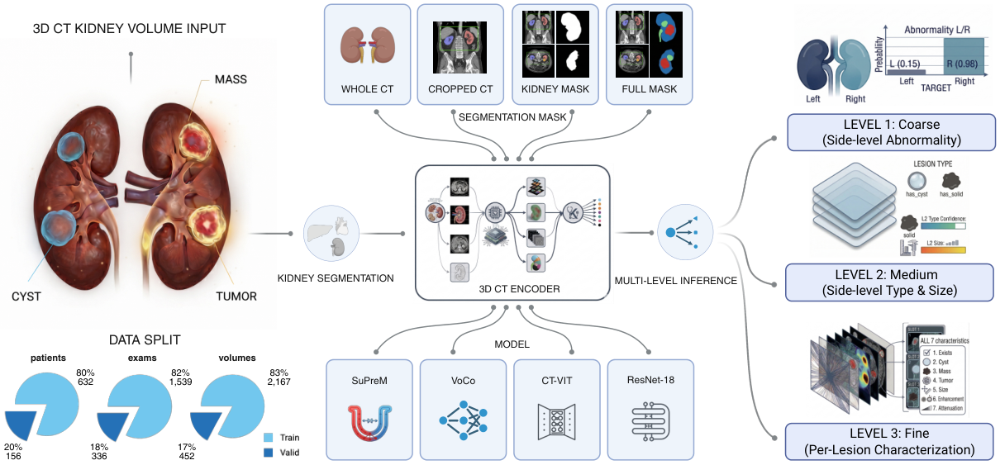

# Multi-Granularity 3D Kidney Lesion Characterization from CT Volumes

Code for the paper *Multi-Granularity 3D Kidney Lesion Characterization from CT
Volumes*. From one 3D kidney CT volume, **LesionDETR** (a DETR-style head with
size-distance Hungarian matching) predicts a variable number of lesions per
kidney with four clinical attributes, while a hierarchical loss also serves
side-level outputs: **L1** abnormality, **L2** type/size, **L3** per-lesion.



Paper numbers (Tables 2–4) are in [`RESULTS.md`](RESULTS.md); they require the
private UF Health data and are not reproducible from the public data here.

## Data

The UF Health dataset **cannot be released** (patient privacy). The code instead
runs on two small public datasets on
[Hugging Face](https://huggingface.co/datasets/LiangRenjie/kidney-3dct-lesion-characterization):

| Dataset | Purpose | Granularity | License |
|---|---|---|---|
| Synthetic (generated by this repo) | full pipeline incl. per-lesion L3 | L1/L2/L3 | MIT |
| KiTS23 subset (6 real cases) | external-validation path | L1/L2 | CC BY-NC-SA 4.0 |

No PHI, reports, or private annotations are in this repo. Details: [`DATA.md`](DATA.md).

## Install & quick start

```bash
pip install -r requirements.txt                          # Python >= 3.10
python tools/generate_synthetic_data.py --out datasets   # tiny fake dataset
python train.py --config-name smoke                      # train LesionDETR end-to-end
```

The smoke test runs the whole pipeline on a GPU (or slowly on CPU) with a
from-scratch encoder; it verifies the code path, not paper numbers.

## Paths & config

Data and weight locations come from environment variables (with runnable defaults):

| Variable | Meaning | Default |
|---|---|---|
| `KIDNEY_DATA_ROOT` | UF-format dataset | `datasets/UF_Kidney_CT/final_dataset` |
| `KITS23_ROOT` | processed KiTS23 | `datasets/KiTS23/processed` |
| `WEIGHTS_ROOT` | pretrained encoder weights | `weights` |

Pretrained encoders (place under `WEIGHTS_ROOT`, or use `encoder=from_scratch`):
[SuPreM](https://github.com/MrGiovanni/SuPreM) (default),
[VoCo](https://github.com/Luffy03/VoCo),
[CT-CLIP](https://github.com/ibrahimethemhamamci/CT-CLIP).

## Layout

```
train.py  eval_kits23.py  eval_l3_full.py     # train + evaluate
models/   data/   analysis/                   # encoders + LesionDETR, datasets, metrics
detection_training/                           # per-lesion head comparison (Table 3)
configs/  tools/                              # configs; synthetic + KiTS23 data tools
```

To reproduce the paper with the real dataset, run `train.py` with the
`encoder` / `ct_level` / `label_level` / `mask_strategy` overrides (see
`configs/` and `detection_training/`). KiTS23 external validation:
`python tools/prepare_kits23.py --raw <kits23> && python eval_kits23.py --checkpoint <best_model.pt>`.

## Citation & license

Code under the [MIT License](LICENSE); KiTS23 data is CC BY-NC-SA 4.0 (see
[`DATA.md`](DATA.md)). Please cite the paper ([`CITATION.cff`](CITATION.cff)):

```bibtex
@article{liang2026kidney3dct,
  title  = {Multi-Granularity 3D Kidney Lesion Characterization from CT Volumes},
  author = {Liang, Renjie and Fan, Zhengkang and Pan, Jinqian and Sun, Chenkun
            and Bian, Jiang and Terry, Russell and Xu, Jie},
  year   = {2026}, note = {Manuscript under review}
}
```

Contact: Renjie Liang — liang.renjie@ufl.edu
